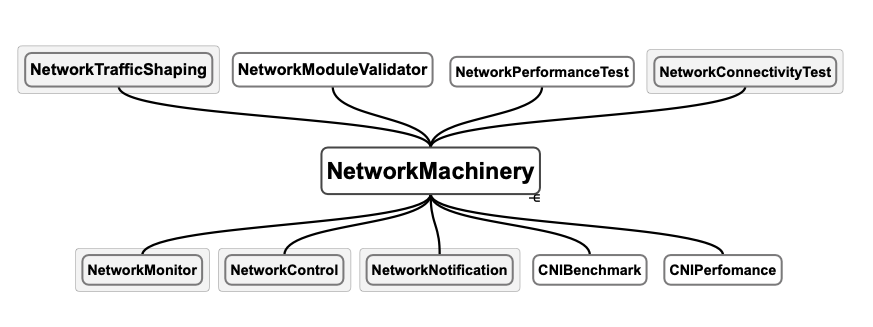

# Networkmachinery-operators

NetworkMachinery is currently a PoC  meant for providing a catalog of network troubleshooting operators ( currently in-tree). Examples of network operators can be found in the image below:



Only the ones highlighted are the ones implemented at the moment.

## How to use

- You can use the `Make` to package and build the container images via `make package && make tag && make push`.
- To deploy to a cluster, have a look at an example helm chart under the kubernetes director.

```bash
kubernetes
└── networkconnectivity
    ├── Chart.yaml
    ├── templates
    │   ├── deployment.yaml
    │   ├── rbac.yaml
    │   └── serviceaccount.yaml
    └── values.yaml
```

- To test and build locally, run `make <controller-name>` for example: 

```bash
  make start-network-monitor
  make start-networkconnectivity-test
  make start-network-control-controller
```
