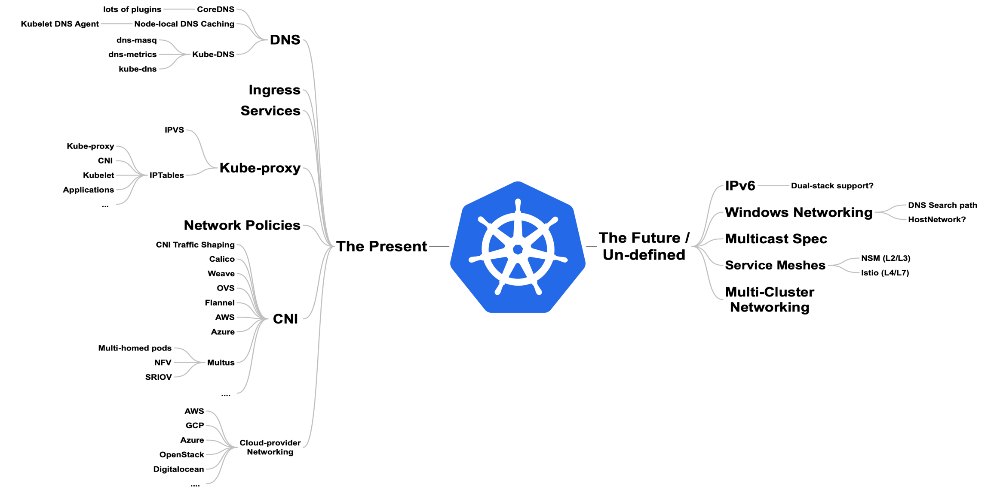
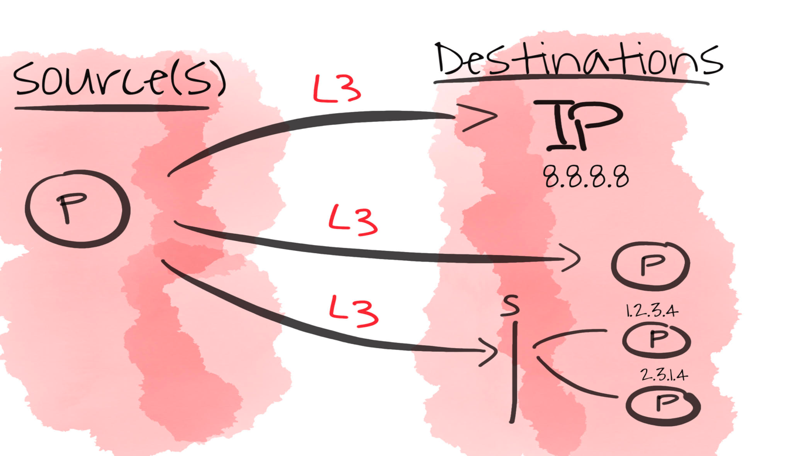
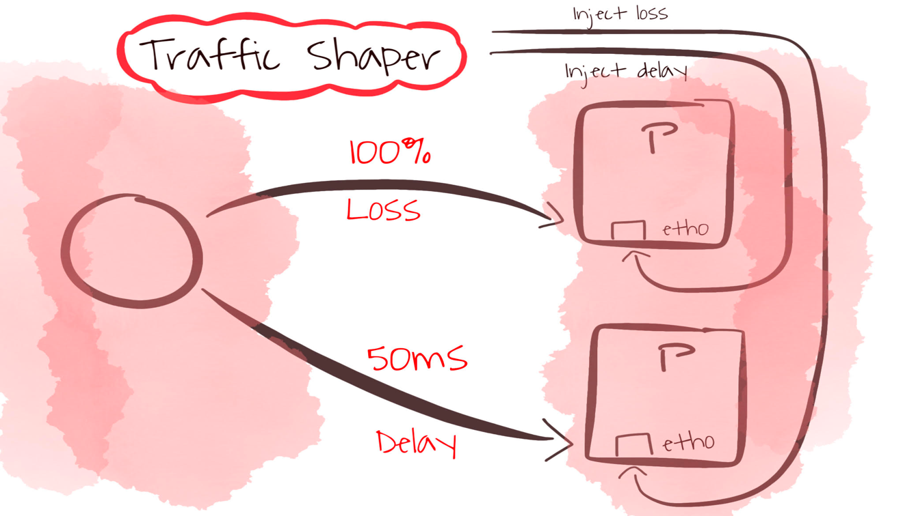

# Network Machinery

The current state of network troubleshooting in Kubernetes is complicated. The knowledge of how to troubleshoot Kubernetes networking is scattered all over the place
either in the heads of highly skilled network crafts-men or as a tool that has its own learning curve and usually forged at a time of disaster in a fire-and-forget fashion. Furthermore, the networking-landscape is quite large and involves alot of topics:



The goal of this project is to introduce a rather simpler way of pooling this common knowledge and tooling together into a well-defined, consistent and community-accepted set of resources
that are available to the average Kubernetes user, examples of operators can be found in the operators section below.

Use-cases include normal networking debugging, network policy validation, CI/CD network assurance, but more use-cases could be covered.

## Operators

Below are some of the operators that are either implemented or planned for implementation:

- [x] Network Connectivity Operator, with CRDs,
      - NetworkConnectivityTest (NCT)

Layer 3 NCT         |  Layer 4 NCT
:-------------------------:|:-------------------------:
 |  

- [x] Network Traffic Shaper, with CRDs:
      - NetworkTrafficShaper
      

- [x] Network Monitoring, with CRDs:
      - NetworkMonitor
      - NetworkNotification
- [ ] Network Controller, with CRDs:
      - NetworkControl
- [ ] Network Module Validator
- [ ] CNIBenchmark
- [ ] CNIPerformance
- [ ] Network Scalability Tester (IPVS and IPTables)
- [ ] Network Problem Detector

## How to use

- You can use `Make` to package and build the container images via `make package && make tag && make push` or simply `make ship`.
- To deploy to a cluster, you need to do the following steps:
  - Run `make webhook`, this installs and configure the certificates required for the webhook to run, as well as the webhook service.
  - Run `make install-crds`, this installs the required CRDs onto the cluster
  - Deploy the helm-chart for the controller onto the cluster:

    ```bash
    helm template kubernetes/networkconnectivity | k apply -f -
    ```

  - Start creating resources (e.g., NetworkConnectivityTest layer-3 or layer-4),for example, to debug network connectivity between two pods on layer-3, you can use the following Custom Resource:

 ```yaml
 ---
apiVersion: networkmachinery.io/v1alpha1
kind: NetworkConnectivityTest
metadata:
  name: smokeping
spec:
  layer: "3"
  source:
    name: "demo-pod-1"
    namespace: "default"
    container: ""
  destinations:
    - kind: pod
      name: demo-pod-2
      namespace: default
    - kind: ip
      ip: "8.8.8.8"
    - kind: service
      namespace: default
      name: demo-service
```

This custom resource defines a smoke ping test, with a source pod, multiple destinations (a pod, an ip endpoint, a service which covers all it's endpoints). With the NetworkConnectivityTest operator, it is possible to specify either a Pod (with name and namespace), a direct IP endpoint (e.g., Google DNS), or a Service (via name and namespace).

To get an idea about how other resources look like, have a look at the `./examples` directory:

```bash
├── networkconnectivity
│   ├── networkconnectivity-crd.yaml
│   ├── networkconnectivity_layer3.yaml
│   └── networkconnectivity_layer4.yaml
├── networkmonitor
│   ├── networkmonitor-crd.yaml
│   └── networkmonitor.yaml
├── networknotification
│   ├── networknotification-crd.yaml
│   └── networknotification.yaml
├── networkperformance
│   └── performance_test.yaml
├── networktrafficshaper
│   ├── networktrafficshaper-crd.yaml
│   ├── networktrafficshaper-delay.yaml
│   └── networktrafficshaper-loss.yaml
└── networkvalidator
    └── naetworkvalidator.yaml
```

**Note**
The network monitoring CRD requires an OVS network plugin as well as an sFlow configured Open vSwitch (consider using the [sFlow Installer](https://github.com/networkmachinery/sflow-ovs-installer))

## Under the hood

Previously, network-machinery operators used the `pod/exec` sub-resource directly on the source pods, this however had the limitation of not being able to `exec` into `distroless` containers. 
Therefore, for clusters with a kubernetes version >= 1.16 ephemeral containers are used. Ephemeral containers share the same network namespace as the source pod, 
as a result all the checks are happening from an image that has all the tooling needed to run the tests (also easier to sustain consistency of the test output).

## Feedback and Support

Feedback, suggestions, contributions are always welcome, the project is done best-effort capitalizing free time whenever it is available :)

## Other references

- [KubeCon EU Network Machinery Talk 2019](https://www.youtube.com/watch?v=JsJoRkmzoa0)